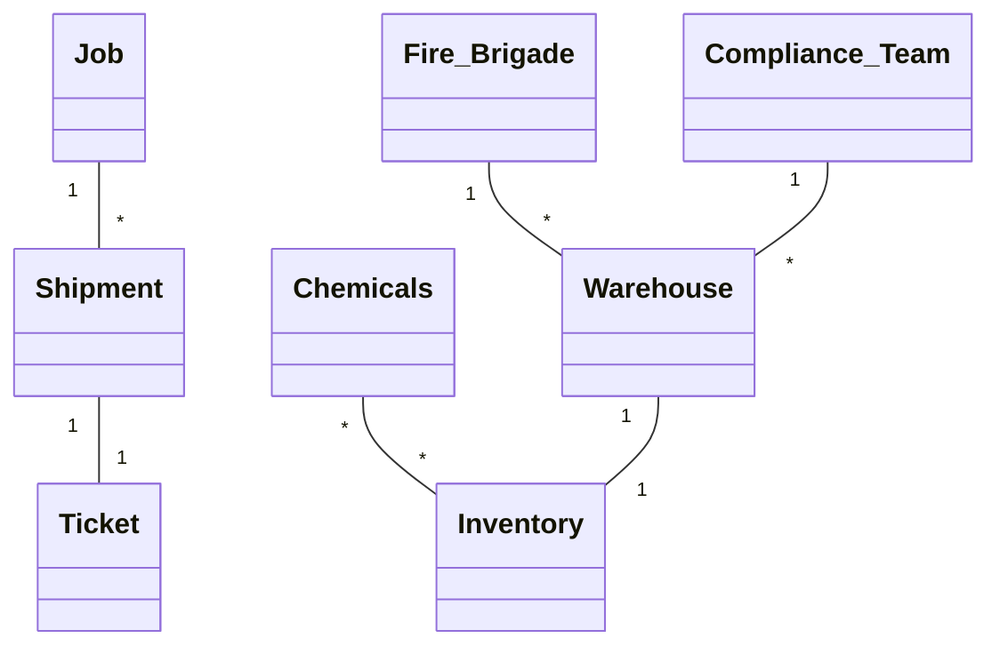
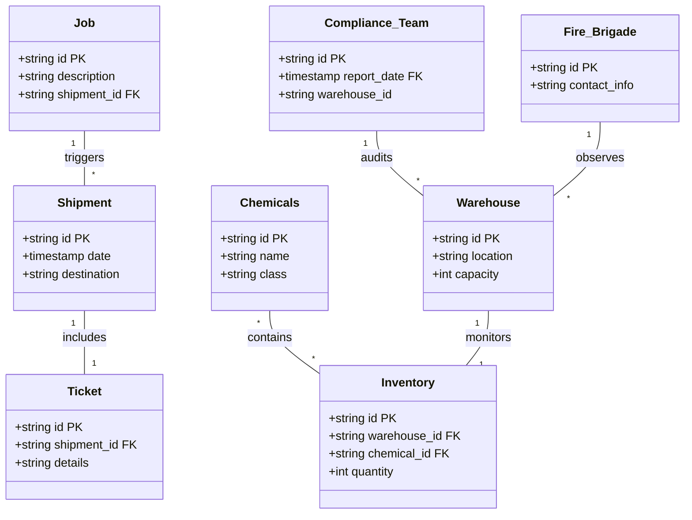

# SP1: Udvikling af store systemer

## Key Information for the Tasks

### Chemicals and Classes
- **Three chemical classes:** A, B, and C.
  - **Class A:** Fire hazard, legal requirements around reporting to the fire brigade if more than 15K units are stored.
  - **Class A and B:** Cannot be stored in the same warehouse.
  - **Class A:** Cannot be stored in adjacent warehouses.
  - **Class C:** Less volatile, fewer restrictions.

### Warehouses and Capacity
- **Warehouses 1 to 5 with capacities in kilo-units:**
  - Warehouse 1: 10K
  - Warehouse 2: 12K
  - Warehouse 3: 5K
  - Warehouse 4: 3K
  - Warehouse 5: 9K
- **Capacity needs to be tracked** to ensure storage rules and restrictions are respected.

### Arrival and Storage Process
- Lorries deliver barrels to the depot and present a shipment ticket.
- Depot must check if there's enough capacity before accepting a shipment.
- Warehouse staff confirm if the shipment matches the ticket.
- Once the chemicals are stored, the job is marked as ‘confirmed.’

### Dispatch Process
- Empty lorries arrive with a ticket requesting a shipment.
- Warehouse staff verify if the requested stock is available and, if so, load the lorry.
- The job is marked as ‘confirmed’ once completed.

### Regulatory and Safety Requirements
- The system must automatically alert the fire brigade if there’s a spillage or fire, including real-time inventory data.
- The system must provide audit information on the storage and movement of chemicals.
- **Audit data** should be disaster-resilient.
- System must communicate with external services (e.g., fire department).

### System Environment
- The software should run on the existing network.

---

## Domain Model & Class Diagram (UML)

### Domain Model for Chemical Warehouse Shipment System:

### Classes:
- **Chemicals**
- **Warehouse**
- **Shipment** (both for receiving and dispatching)
- **Job**
- **Ticket**
- **Inventory**
- **Fire Brigade**

### Class Diagram:
Class diagram for the chemical inventory system. The diagram shows the relationships between entities in the system.

### Other Information:
- Class A and B Chemicals cannot be stored in the same warehouse.
- Class A Chemicals cannot be stored in adjacent warehouses.
- The Fire Brigade must be notified if Class A Chemicals exceed 15K units or during fire/spillage events.

---

## Use Case Diagram

### Warehouse Staff
- Accept Shipment
- Check Capacity
- Store Chemicals
- Dispatch Chemicals

### Compliance Team
- Manage Compliance Rules

### System
- Trigger Fire Alert (up-to-date inventory)
- Provide Audit Report
- Manage Compliance Rules (may overlap with the Compliance Team)

### Fire Brigade (external system interaction)
- Trigger Fire Alert (System sends notifications to the fire brigade)

---

## User Stories (with Acceptance Criteria)

### Functional Requirements:

1. **As a Warehouse Staff**,  
   I want to check if the shipment matches the ticket, so that I can ensure the delivery details are accurate before confirming the job.  
   - **Acceptance Criteria:** The system must validate the ticket details against the actual shipment before confirmation.

2. **As a Warehouse Staff**,  
   I want the system to mark the job as ‘confirmed’ after the chemicals are stored, so that I can track completed shipments.  
   - **Acceptance Criteria:** The system must automatically mark the job as 'confirmed' after the shipment is stored.

5. **As a Warehouse Manager**,  
   I want the system to ensure that chemicals from class A and B are stored separately, so that I can maintain safety compliance.  
   - **Acceptance Criteria:** The system must prevent scheduling shipments that store class A and B chemicals in the same warehouse.

6. **As a Warehouse Manager**,  
   I want the system to prevent storing class A chemicals in adjacent warehouses, so that I can ensure compliance with legal fire hazard regulations.  
   - **Acceptance Criteria:** The system must ensure class A chemicals are not scheduled for storage in adjacent warehouses.

7. **As a Compliance Team**,  
   I want the system to track the storage and movement of chemicals, so that I can generate audit reports for regulatory purposes.  
   - **Acceptance Criteria:** The system must generate audit reports with a detailed history of chemical storage and movements.

---

### Non-Functional Requirements:

1. **As the Chemical Hazard Team**,  
   I want the system to automatically notify the fire brigade if the storage of class A chemicals exceeds 15K units, so that the fire brigade can be placed on alert in case of emergency.  
   - **Acceptance Criteria:** The system must send an automatic alert to the fire brigade if class A chemical storage exceeds 15K units.

2. **As the Chemical Hazard Team**,  
   I want the system to automatically alert the fire brigade in the event of a spillage or fire, so that emergency services are notified in real-time.  
   - **Acceptance Criteria:** The system must automatically alert the fire brigade with real-time inventory data during spillage or fire events.

3. **As the Compliance Team**,  
   I want the audit data to be resilient in case of a disaster, so that I can still access historical data after a catastrophic event.  
   - **Acceptance Criteria:** The system must ensure audit data is disaster-resilient and accessible even after catastrophic site incidents.

4. **As the System Administrator**,  
   I want the system to be able to communicate with external services like the fire department, so that external alerts and communications can happen seamlessly.  
   - **Acceptance Criteria:** The system must be able to integrate and communicate with external services such as the fire department.

5. **As a System Administrator**,  
   I want the software to run on the existing network, so that the system can function without requiring new infrastructure.  
   - **Acceptance Criteria:** The software must be compatible with the existing network infrastructure.

